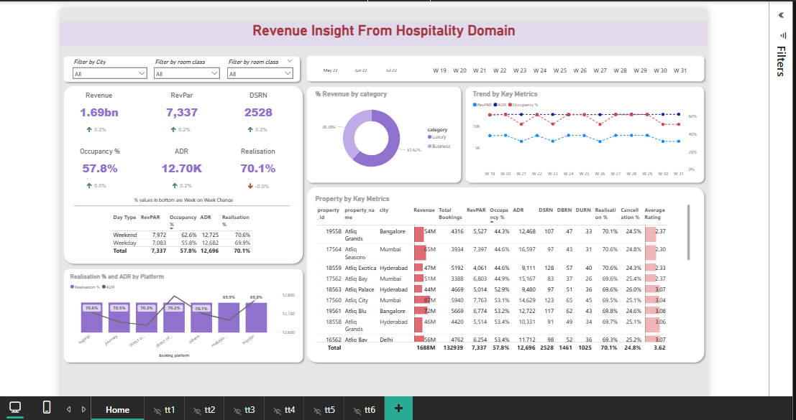

# 💰 Revenue Insights in Hospitality Domain  


---

## 📊 Project Overview  

> An end-to-end analytics project delivering **revenue insights in the hospitality domain**, helping identify trends, performance drivers, and opportunities to increase revenue.  

---

## 🚀 Workflow  
<p align="center">  </p>

### 📥 Data Collection  
```python
# Tools & Sources
- SQL Server / Database Exports
- Excel / CSV files from Hospitality Operations
- Revenue, Bookings, Customer, and Seasonal Data
